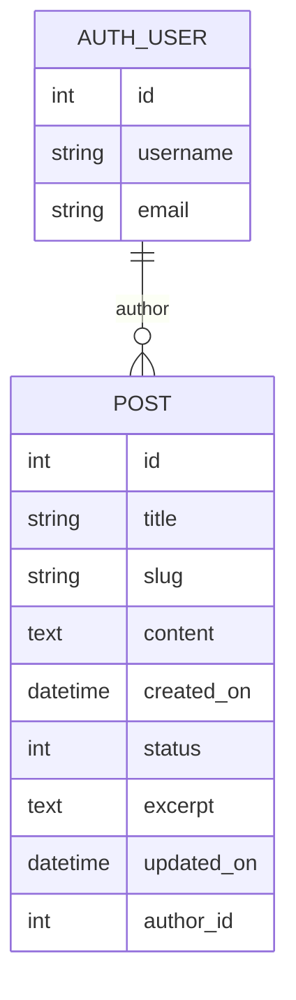

```mermaid
erDiagram
    AUTH_USER ||--o{ POST : author

    AUTH_USER {
        int id
        string username
        string email
    }

    POST {
        int id
        string title
        string slug
        text content
        datetime created_on
        int status
        text excerpt
        datetime updated_on
        int author_id
    }
```
